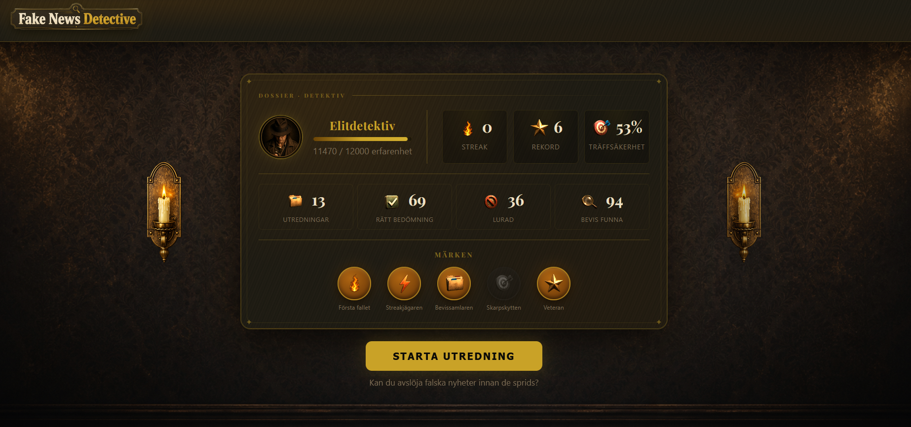
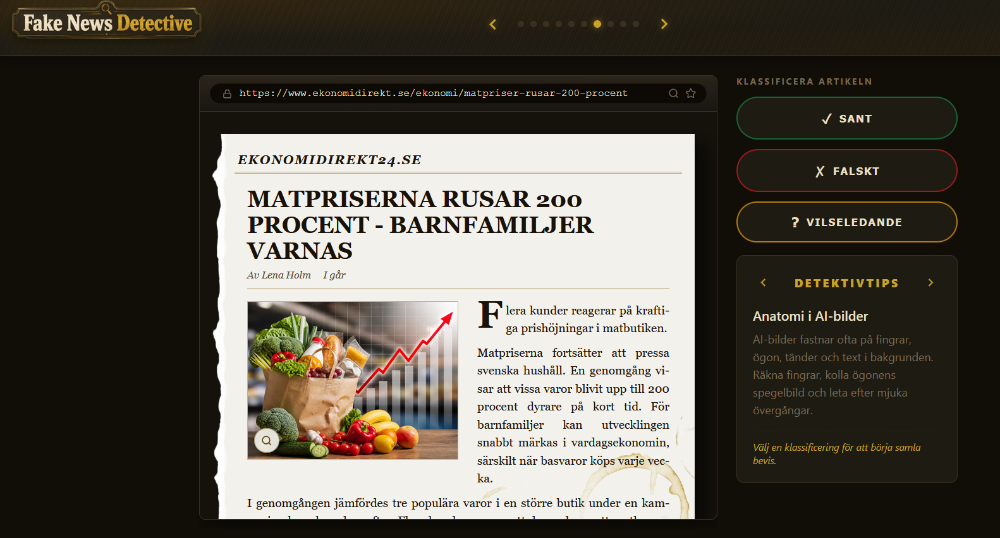
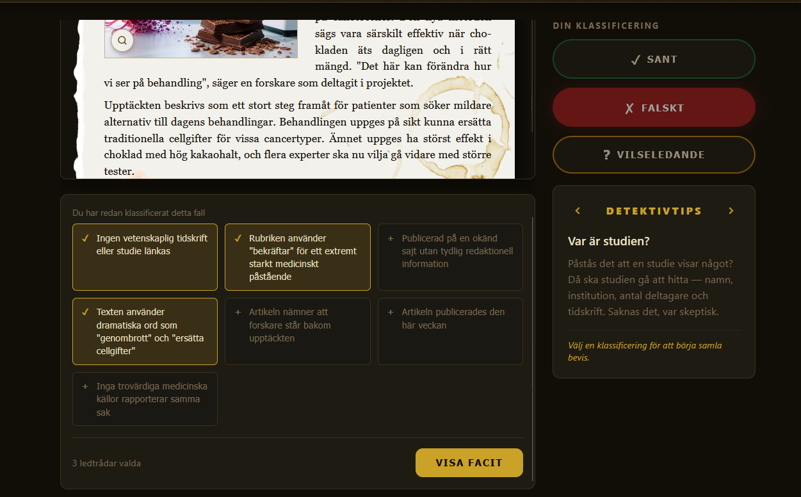
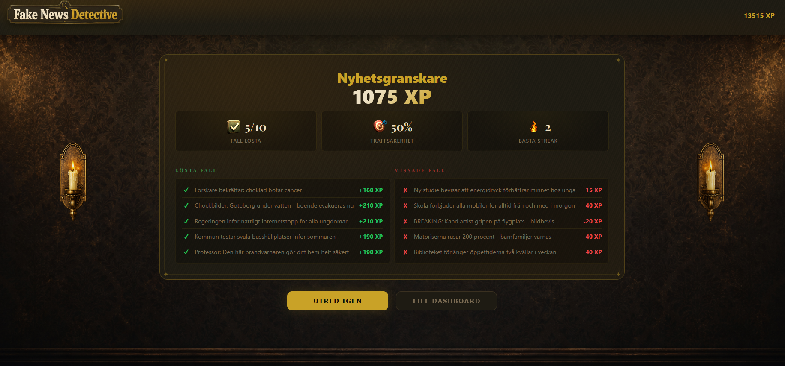

# Fake News Detective — Hackathon 2026

Semicolon squad: Caroline Fagner, Christine Blomstrand och Therese Lindberg

## Beskrivning

Fake News Detective är en React-webapp där spelaren tränar på att identifiera fake news och utveckla sitt kritiska tänkande kring information på internet.

Spelaren läser artiklar och sociala medieinlägg och analyserar innehållet för att hitta varningssignaler. Genom att klassificera rätt och välja relevanta bevis samlar spelaren XP, klättrar i detektivranken och låser upp badges.

## Skärmdumpar

|                Startsida                |               Spelsidan                |
| :-------------------------------------: | :------------------------------------: |
|  |  |

|                   Bevissektion                   |                 Sammanfattning                 |
| :----------------------------------------------: | :--------------------------------------------: |
|  |  |

## Funktioner

- Läs och analysera 10 fall — artiklar, rubriker, bildposter och sociala medieinlägg
- Klassificera varje fall som **SANT**, **FALSKT** eller **VILSELEDANDE**
- Välj ut relevanta bevis för att styrka din analys
- Undersök inbäddade länkar — rapporter, döda länkar och suspekta URL:er
- Poängsystem med tidsbonus för snabba svar
- Ranksystem med 9 nivåer (från "Junior Skeptiker" till "Legendär Faktagranskare")
- Badsgesystem med 5 achievements
- Detektivtips för källkritik i spelgränssnittet
- Persistent statistik sparas mellan sessioner
- Responsiv design — fungerar från 320 px (mobil) upp till desktop

## Exempel på varningssignaler spelaren kan hitta

- Märkliga eller falska URL:er
- Bilder som inte stämmer med artikeln (omvändbildsökning)
- Obekräftad eller felciterad forskning
- Klickbeten och överdrivna rubriker
- Saknade eller opålitliga källor
- Manipulerad statistik
- AI-genererade eller redigerade bilder

## Syfte

- Öka medvetenheten kring desinformation
- Lära användare att tänka källkritiskt
- Träna spelare i att granska information innan den delas eller tros på

## Teknikstack

### Frontend

- React 19 + TypeScript
- Vite (byggverktyg och dev-server)
- SCSS med BEM-namngivning
- lucide-react (ikoner)

## Installation

Klona projektet:

```bash
git clone https://github.com/Semicolonsquad/fake-news-detective-hackathon2026.git
```

Gå till projektmappen:

```bash
cd fake-news-detective-hackathon2026
```

Installera dependencies:

```bash
npm install
```

Starta utvecklingsservern:

```bash
npm run dev
```

## Framtida funktioner

- Leaderboard
- Dagliga utmaningar
- Tidsbegränsade uppdrag
- Multiplayer-läge
- AI-genererade artiklar
